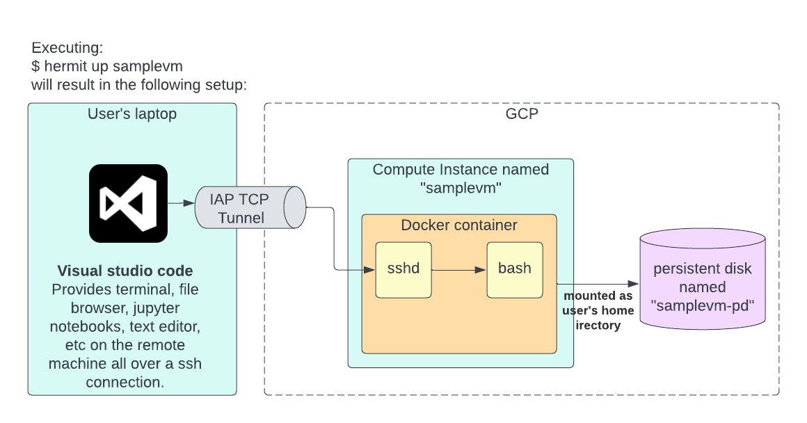

`hermitcrab`: A simple way to provision a development enviornment on google
cloud platform.

# Motivation

Being able to spin up a machine on the cloud is useful when working with
large data that live on the cloud. However, the realities of maintaining a
machine on the cloud are a fair amount of work, especially if one doesn't
have a lot of experience with GCP and linux.

More specifically, `hermit` attempts to address the following problems:

Problem 1: The `gcloud` CLI to GCP is extremely flexible, but that flexibility makes it
harder to use. Commands tend to all have a lot of options and there's a fair
amount of typing to get to the command you want.

`hermit` tries to be a slimmed down CLI providing the core functionality a
developer who wants a dev environment on the cloud would need.
It does this by having sensible defaults for creating and lots of paranoid
santity checks to ensure operations do what's expected. In the result of a
problem, logs are kept for postmortems.

Problem 2: When people manage their own servers, there's a tendency for
packages to get installed locally in an adhoc fashion. This results in
difficulty reconstructing the state of the server if someone else would like
the same environment. It also runs the risk of the environment breaking and
not having a good way to backtrack to a sane state.

The solution taken by hermit-crab is to encourage the use of Docker to manage system
installed tools and libraries. By having the system files coming from a
docker image, we have the recipe for how that environment captured in the
Dockerfile which created that image. Those images can be shared as well as
versioned alongside the Dockerfiles used to create them.

Problem 3: The GCP's IAM service is great for fine grained access control, and a boon 
for reducing risk due to compromised accounts. However, at the same time, the number one 
blocker that I've observed users have when working with GCP is navigating which permissions
they need to grant to different accounts. Hermit tried to automatically grant reasonable default 
permissions to a service account which it sets up, so that users don't need to worry about 
explictly managing grants.

## Note: Containers must be set up specially for hermit

See dockerimage/basic for an example of the minimium setup required for 
an image to be compatible with Hermit.

# Commands

```
hermit create [name] [docker_image]
```

Creates a persistent disk to hold data, and creates a configuration file in
`~/.hermit/instances` with the information need to create a VM with this
disk mounted.

This will also update your `~/.ssh/config` file with information that ssh
can use to seamlessly connect to your instance when its running.

Example: `hermit create test-hermit us.gcr.io/broad-achilles/hermitcrab`

```
hermit up [name]
```

Starts an instance for the config with the given name. The created instance
will have the same name as the configuration. If no name is provided, it
defaults to "default".




```
hermit down [name]
```

Deletes the instance, but the persistent disk and the image will remain. As
a result you can execute `hermit up` at a later time to reconstruct the
environment.

This is primarily to shut down the instance to save on costs. However,
shutting it down are bringing it back up is also a good way to reset the
system files to their original state from the docker image.

# Cautionary notes

## Docker

Since "ssh name" takes to you to a shell within a container, and the docker
demon runs _outside_ of the container, you may encounter surprising
behavior. For example mounting directories other than /home/ubuntu or /tmp will not
work as expected because it will use the filepath outside of the container.

(For example you may see an error like "invalid mount config for type bind ... bind source path not does exist")

Mounting locations under /home/ubuntu, however, will work because the 
same directory named /home/ubuntu exists inside and outside of the
container.

## Suspend on Idle

Every minute, there's a process that checks if the docker container has
used any network traffic. If yes, the machine runs normally. However, if
nothing has happened for the timeout `suspend_on_idle_timeout` to expire,
the server will suspend itself.

Even if you are running a large CPU heavy job and don't have
anything printed out as output, the idle check may decide the server is idle
and suspend it.

(I'm considering adding a check on "load average" as well, but at this time
it's only checking network activity.)

To unsuspend, simply re-run `hermit up`

# Using hermit to build docker images

Now that macs ship with non-intel processors, it can take a lot longer to
build images locally. Fortunately, docker already supports building on
remote machines. Hermit starts remote machines, so the two can work together
seamlessly.

First power up a machine ala (I named my machine 'image-builder'):

```
hermit up image-builder
```

And then you can run docker build using that host:

```
DOCKER_HOST=ssh://image-builder docker build . -t sample-image
```

# Tips and tricks

## Changing machine type 

In order to change how much memory or number of CPUs you are using, change the machine type of your instance.

Since the "hermit down" command deletes the VM and "hermit up" creates a new VM each time, it's trivial to change what type of machine you want to use at any time. Just bring your instance offline via `hermit down` and then edit the config `$HOME/.hermit/instances/INSTANCE_NAME.json`, updating the value of `machine_type` to be which ever machine type you want.

Once you've saved your changes, do a `hermit up` and the new instance will be created with that machine type.

## Resizing home directory

You can use gcloud to resize the volume and you don't even have to bring the
machine offline to do so. Execute the following where
`DISK_NAME` is the value of `pd_name` in
`$HOME/.hermit/instances/INSTANCE_NAME.json` and DISK_SIZE is the new size
in GBs. 

```
gcloud compute disks resize DISK_NAME --size DISK_SIZE
```

Now that the drive is enlarged, you need tell the OS to use the new space.

```
gcloud compute ssh INSTANCE_NAME -- sudo resize2fs /dev/sdb
```

## Enlarging the docker volume

The above works for the home directory, however, you may get an
"unsufficient space" error from docker if you are pulling a lot of images,
or building lots of images. These images are stored on the boot volume of 
the VM so the easiest way to change the size is edit `$HOME/.hermit/instances/INSTANCE_NAME.json`
and set `boot_disk_size_in_gb` to whatever you want.

The boot volume is created during `hermit up` and destroyed during `hermit
down` so to make the change take effect, just bring the instance down and
then back up. After it's initialized the boot volume will be the new size.

# Troubleshooting

All gcloud commands are logged to hermit.log. That can be a good place to
look and understand what is going on.

If you want to connect to the VM outside of the container, you can via

```
gcloud compute ssh MACHINE_NAME
```

(where `MACHINE_NAME` is the name of the instance) 

Contrast this to running:

```
ssh MACHINE_NAME
```

which will log you into a session _inside_ the container running on
`MACHINE_NAME`.

If you encounter problems, you may want to look at the logs of the service which starts the inner container:

```
gcloud compute ssh MACHINE_NAME -- sudo journalctl -u container-sshd
```

Similar, if there's problems with the auto-suspend, you can look at the `suspend-on-idle` service:

```
gcloud compute ssh MACHINE_NAME -- sudo journalctl -u suspend-on-idle
```

Alternatively, you can always look at all the recent logs across the entire machine:

```
gcloud compute ssh MACHINE_NAME -- sudo journalctl --since "10 minutes ago"
```
